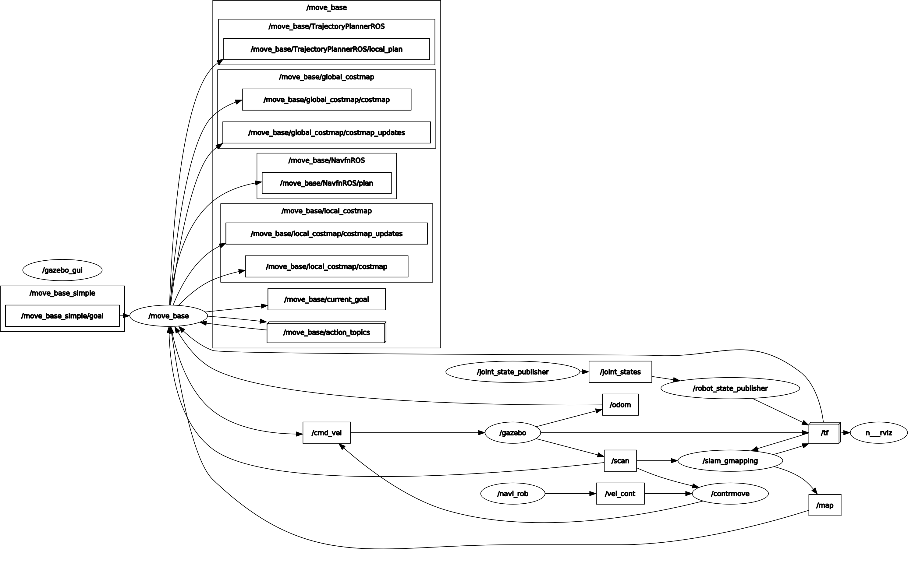

# Third_assignment
--------------------

  INTRODACTION:
  ==============
  ---------------
  
  This is the third and final assignment of Research truck I; 
  In this task we had to create software capable of controlling a mobile robot, 
  creating a multiple choice user interface, which allows the user to choose how to control the robot.
  
  In the user interface with three choices:

A) GO TO POINT: Where the user enters the coordinates of the point where the robot must go.

B) CONTROLLER: Where the user moves the robot with a controller, but the robot can crash with obstacles.

C) ASSISTENT CONTROLLER: where the user moves the robot with a controller, but the robot does not crash into obstacles, because it is equipped with laserscan which makes it stop near obstacles.

the professor has provided us with packages that simulate the robot in a certain environment delimited by walls; 
the simulator we used is Gazebo and Rviz.

  MATERIAL AND METHODS:
  =====================
  ---------------------
  
To develop this application we have created two nodes written in C ++, using ROS (ROBOT OPERAITING SYSTEM); 
the nodes we have developed are cont_move.cpp (control moviment) and navi_goal_rob.cpp (navigation and goal for robot). 
These two nodes communicate with each other and one interfaces with the user, while the other communicates with the robot.
The cont_move.cpp node communicates through publisher/subscriber with /cmd_vel, 
with nodonavi_goal_rob.cpp and with  Laserscan.
It receives information from navi_goal_rob.cpp, 
which indicates whether the user wants to increase or decrease the speed of the robot or if he wants to turn left or right,
and tells him whether the user wants to activate the assistant controller or not;
this communication occurs through the vel() function. 
then from the /Laserscan it receives the distance of the robot from the obstacles, 
and if the user had chosen the assistent controller it blocks the speeds in the direction of the obstacles,
if instead he had not chosen the assistant controller it continues to give the speeds to the robot,
until does not crash into obstacles; then publish the (linear and angular) speeds of the robot to / cmd_vel,
using the assistcont() function.
The navi_goal_rop.cpp node is the node that interfaces with the user and captures his choices
(A: GO TO POINT B: CONTROLLER C: ASSISTENT CONTROLLER).
In the first choice the gopoint() function is called, 
This function asks the user to enter the coordinates of the point, 
then checks if these coordinates are inside the perimeter (if not, it asks the user to enter new coordinates)
and a the coordinates have been verified), sends cont_move.cpp not to publish on /cmd_vel,
and adjusts the parameters for the goal and sends them to the MoveBaseAction server;
Then who is the user if he wants to delete the goal; in the positive case it cancels the goal, 
in the negative case it activates the time out of 25 seconds,
and finally we receive the answer whether the robot has reached the goal or not.
If the user chooses the assistant controller or the controller The controller() function is called, 
except that depending on the case the cont_move.cpp node,
is asked through /vel_cont to activate or not the assistant controller.
The controller() function collects the data entered by the user for linear and angular velocity,
and it sends to cont_move.cpp using / vel_cont; If you want to stop the robot, 
enter 'R' (resetting the speeds) or if you want to return to the initial menu, enter 'A'.
Finally we created a launch file that starts the simulator,
and the cont_move node in one terminal and the navi_goal_rob.cpp node (graphical interface) in another terminal.
____________________________________________

